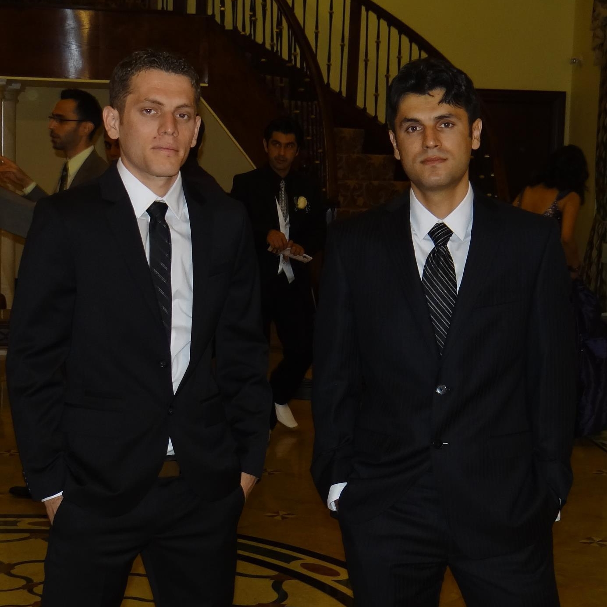

# Building a MyDMV-Applicaion with AngularJS

 This is the repository for my course, [Building a Data-Driven App with AngularJS](http://www.lynda.com/AngularJS-tutorials/Building-Data-Driven-App-AngularJS/368918-2.html). The full course is available at  [lynda.com](http://lynda.com).

## Instructions
This repository has branches for each of the videos in the course. You can use the branch pop up menu in github to switch to a specific branch and take a look at the course at that stage. Or you can simply add `/tree/BRANCH_NAME` to the URL to go to the branch you want to peek at.

1. Make sure you have these installed
    - [node.js](http://nodejs.org/)
    - [git](http://git-scm.com/)
    - [gulp](http://gulpjs.com/)
2. Clone this repository into your local machine using the terminal (mac) or Gitbash (PC) `> git clone https://github.com/planetoftheweb/angulardata.git`
3. CD to the folder `cd angulardata`
4. Run `> npm install` to install the project dependencies

For more help setting up a comprehensive Gulp.js workflow, check out [Web Project Workflows with Gulp.js, Git, and Browserify](http://www.lynda.com/Web-Web-Design-tutorials/Web-Project-Workflows-Gulpjs-Git-Browserify/154416-2.html).

